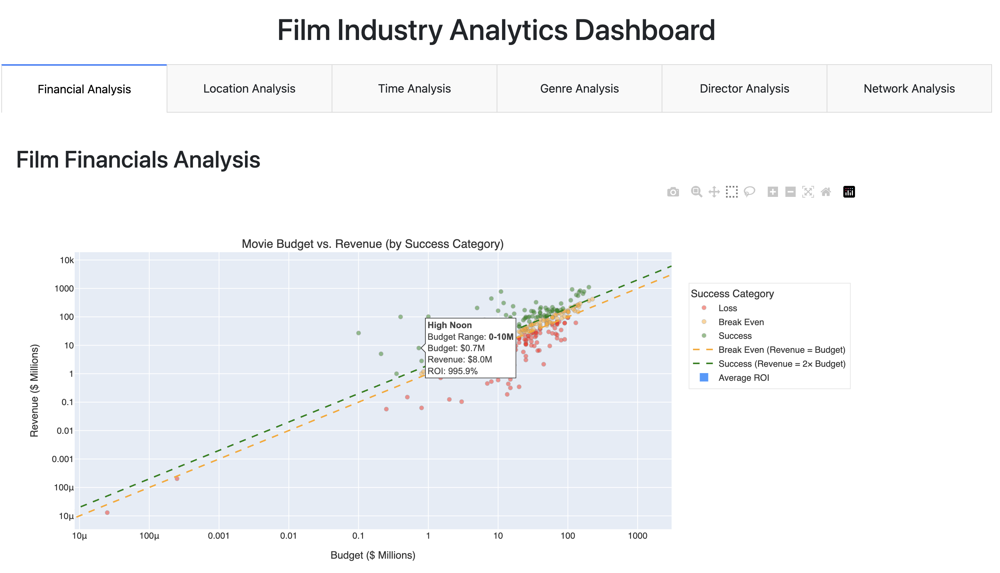

# 🎬 Lights, Camera, Analytics!
## Film Production Trends Analysis


<!-- Replace the path above with your actual banner image -->

---

## Project Overview

The global film industry is a competitive landscape where success is influenced by a combination of creative, cultural, and economic factors. As new production studios emerge, understanding the variables that contribute to long-term profitability and critical acclaim becomes essential for sustained success. 

However, the abundance and complexity of film industry data—ranging from box office performance, runtime, and cast collaborations to genre trends and global shooting locations—pose significant barriers to entry for aspiring movie studios. 

---
## Dashboard Features

This interactive Dash application provides six comprehensive analytical tabs:

### 📊 Financial Analysis
- **Movie Budget vs. Revenue Scatter Plot** - Interactive visualization categorizing films by success level (Loss, Break Even, Success) with log-scale axes for better data distribution
- **Average ROI by Budget Range** - Bar chart analyzing return on investment across different budget brackets (0-10M through 200M+)

### 🌍 Location Analysis
- **Global Film Production Heatmap** - Choropleth map displaying film production distribution by country
- **Country Market Share by Revenue** - Donut chart showing top film-producing countries and their market share

### 📅 Time Analysis
- **Release Day Heatmap** - Interactive heatmap showing optimal release timing by month and day of week, with dropdown to view different metrics (Revenue, Profit, ROI, Movie Count)
- **Runtime Trends by Genre** - Line chart tracking average movie runtime over time with genre filtering capability

### 🎬 Genre Analysis
- **Genre Ratings Bar Chart** - Sortable horizontal bar chart displaying top genres by average rating, revenue, or budget

### 🎥 Director Analysis
- **Top Directors by Metrics** - Sortable horizontal bar chart showcasing top 20 directors ranked by average rating, revenue, or budget

### 🔗 Network Analysis
- **Director-Studio Collaboration Network** - Interactive network graph visualizing relationships between directors and production companies, with customizable node counts and hover-to-highlight connections

> **Note:** All visualizations feature interactive elements including hover tooltips, filtering options, and responsive design for optimal viewing across devices.

---

## Tech Stack

### Back-End Technologies

| Technology 
|-----------|
| **Python** | 
| **NumPy** | 
| **Pandas** | 
| **NetworkX** | 
| **Logging** | 

### Front-End Technologies

| Technology 
|-----------|
| **Plotly** | Interactive visualizations (scatter plots, bar charts, heatmaps, network graphs, pie charts) |
| **Dash** | Web dashboard development for interactive data exploration |

---

## Dataset

**Source:** [Movie Dataset: Budgets, Genres, Insights](https://www.kaggle.com/datasets/utkarshx27/movies-dataset) by Utkarsh Singh on Kaggle

**Specifications:**
- **Size:** 23.43 MB
- **Rows:** 4,803 films
- **Columns:** 24 features
- **Last Updated:** 2023

**Key Features:**
- Budget and revenue data
- Runtime and release dates
- Genre classifications
- Production companies
- Cast and crew information
- Ratings and reviews
- Language and country of origin
- Global shooting locations

---

## 📁 Project Structure

```
film-analytics-project/
│
├── data/
│   └── movies_dataset.csv
│
├── notebooks/
│   └── exploratory_analysis.ipynb
│
├── src/
│   ├── data_cleaning.py
│   ├── visualizations.py
│   └── network_analysis.py
│
├── assets/
│   └── styles.css
│
├── app.py
├── requirements.txt
└── README.md
```

---


